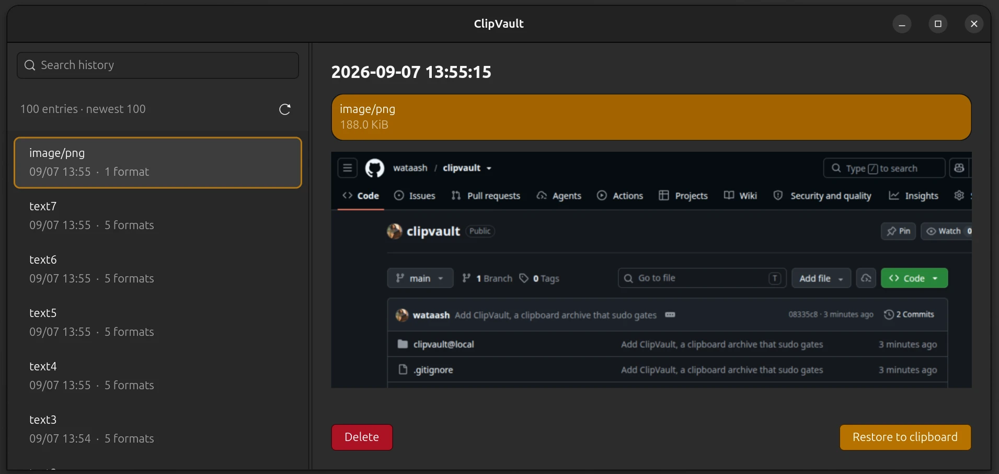

# ClipVault

Archives the GNOME 50 / Wayland clipboard automatically and requires sudo authentication to restore from it.
Processes running as the login user are not given permission to read the stored history.



## Files

| File | Role |
|---|---|
| `clipvault@local/` | GNOME Shell extension. Watches Meta.Selection for changes and reads the copy source asynchronously |
| `clipvault.py` | Append-only service written against the Python standard library alone. SQLite storage, search and delete after authentication |
| `restore.py` | Command for the login user. After sudo authentication it receives only the selected data over a pipe and hands it to wl-copy |
| `gui.py` | GTK 4 history list, search, preview, restore and delete. GUI authentication through sudo's askpass |
| `io.github.wataash.ClipVault.desktop` | Registration in the GNOME app list |
| `clipvault.service` / `clipvault.socket.in` | Dedicated user, socket credentials, service restrictions |

Required software: GNOME Shell 50, GJS, Python 3 with sqlite3, systemd, sudo, wl-copy.
The GUI uses the system Python's PyGObject, GTK 4, GdkPixbuf and Zenity.
No network access is needed.

## First installation

The commands in this README assume bash. A block that needs them starts by setting `user` to the login user whose
clipboard is collected and `src` to the path of this project; adjust those lines and the rest of the block needs no changes.

```sh
# Installation (bash)
user=wsh
src=/home/wsh/src/clipvault

# Prepare the configuration in a temporary directory as the login user
cd "$(mktemp -d)/"
sed "s/@USER@/$user/g" "$src/clipvault.socket.in" > clipvault.socket
printf '{"allowed_uid":%s,"max_db_bytes":1073741824}\n' "$(id -u "$user")" > clipvault.json
printf '%s\n' "$user ALL=(clipvault) PASSWD: NOSETENV: /usr/bin/python3 -I /usr/local/lib/clipvault/clipvault.py browse, /usr/bin/python3 -I /usr/local/lib/clipvault/clipvault.py session" > clipvault-sudoers
tail -n +1 -- *
# Expected result: clipvault-sudoers: parsed OK
/usr/sbin/visudo -cf clipvault-sudoers

# Create the dedicated account
sudo /usr/sbin/useradd --system --user-group --home-dir /nonexistent/ --no-create-home --shell /usr/sbin/nologin clipvault
id clipvault  # uid=994(clipvault) gid=970(clipvault) groups=970(clipvault)
# Install the capacity setting
sudo install -o root -g root -m 0644 clipvault.json /etc/clipvault.json

# Install the root-managed programs and configuration
sudo install -d -o root -g root -m 0755 /usr/local/lib/clipvault/ /usr/local/share/applications/
sudo install -o root -g root -m 0644 "$src/clipvault.py" /usr/local/lib/clipvault/clipvault.py
sudo install -o root -g root -m 0755 "$src/restore.py" /usr/local/bin/clipvault
sudo install -o root -g root -m 0755 "$src/gui.py" /usr/local/bin/clipvault-gui
sudo install -o root -g root -m 0644 "$src/io.github.wataash.ClipVault.desktop" /usr/local/share/applications/io.github.wataash.ClipVault.desktop
sudo install -d -o clipvault -g clipvault -m 0700 /var/lib/clipvault/
sudo install -o root -g root -m 0644 "$src/clipvault.service" /etc/systemd/system/clipvault.service
sudo install -o root -g root -m 0644 clipvault.socket /etc/systemd/system/clipvault.socket
sudo install -o root -g root -m 0440 clipvault-sudoers /etc/sudoers.d/clipvault

sudo tail -n +1 /usr/local/lib/clipvault/* /usr/local/bin/clipvault /etc/systemd/system/clipvault.service /etc/systemd/system/clipvault.socket /etc/sudoers.d/clipvault

# Apply the service configuration and start the append socket
sudo systemctl daemon-reload
sudo systemctl enable --now clipvault.socket

# Remove the temporary files and return to the project
rm -- clipvault.socket clipvault.json clipvault-sudoers
rmdir -- "$PWD/"
cd "$src/"

# The extension is installed as the login user. It is a symlink, so updates need neither sudo nor a reinstall
mkdir -p ~/.local/share/gnome-shell/extensions/
ln -s "$PWD/clipvault@local" ~/.local/share/gnome-shell/extensions/clipvault@local
# You are not logged out automatically. Save your work, then log in again.
```

```sh
# Enable and verify after logging in again (bash)
# Copy some test string first, then run this block.
gnome-extensions enable clipvault@local
gnome-extensions info clipvault@local
systemctl --no-pager status clipvault.socket
# Expected state: the extension is enabled and clipvault.socket is active (listening)
# The GUI opens next. Authenticate at startup, then pick an entry and a format and restore it.
clipvault-gui
# The check is complete once the history appears after authentication and a restore works.
```

## Adding the GUI to an existing installation

```sh
# Adding the GUI to an existing installation (bash)
# Installs the programs and the GUI without touching the history or the capacity setting
user=wsh
src=/home/wsh/src/clipvault
cd "$(mktemp -d)/"
printf '%s\n' "$user ALL=(clipvault) PASSWD: NOSETENV: /usr/bin/python3 -I /usr/local/lib/clipvault/clipvault.py browse, /usr/bin/python3 -I /usr/local/lib/clipvault/clipvault.py session" > clipvault-sudoers
/usr/sbin/visudo -cf clipvault-sudoers
tail -n +1 -- *
# Expected result: clipvault-sudoers: parsed OK
sudo install -o root -g root -m 0644 "$src/clipvault.py" /usr/local/lib/clipvault/clipvault.py
sudo install -o root -g root -m 0755 "$src/restore.py" /usr/local/bin/clipvault
sudo install -o root -g root -m 0755 "$src/gui.py" /usr/local/bin/clipvault-gui
sudo install -o root -g root -m 0440 clipvault-sudoers /etc/sudoers.d/clipvault
sudo install -d -o root -g root -m 0755 /usr/local/share/applications/
sudo install -o root -g root -m 0644 "$src/io.github.wataash.ClipVault.desktop" /usr/local/share/applications/io.github.wataash.ClipVault.desktop
rm clipvault-sudoers
rmdir "$PWD/"
cd "$src/"

# Open the GUI. "ClipVault" in the app list starts it as well
clipvault-gui
# Authenticate at startup, then search, pick an entry and a format, and press "Restore to clipboard"
# The authentication cache follows the system sudo configuration. The terminal interface is available as clipvault
```

## Restore, search and delete

Open the GUI from "ClipVault" in the app list or with the command below.
On an existing installation, run [the GUI installation steps](#adding-the-gui-to-an-existing-installation) first.

bash:

```sh
clipvault-gui
# Another entry point to the same GUI
clipvault --gui
```

Authenticate with sudo at startup, pick an entry from the list on the left and a format from the selector on the right.
Text and images can be previewed, and "Restore to clipboard" copies the original bytes.
The text preview shows the first 64 KiB; restoring uses the whole content. HTML is displayed as text and never executed.
Search matches substrings over the whole history and shows the newest 100 entries. Deletion goes through a confirmation dialog.
Closing the window ends the history view and the backend session. The sudo authentication cache is left untouched.

For terminal use:

bash:

```sh
clipvault
```

Shows the newest 100 entries in the terminal through sudo. The authentication cache follows the system sudo configuration.
Enter a number and pick one MIME format, and those bytes are restored to the clipboard.
Images are returned as stored, without re-encoding.
A restore is itself collected, so it is recorded in the history as a new copy.

| Input | Action |
|---|---|
| `1` and so on | Pick the format to restore from the listed entry |
| `/term` | Substring search over all text formats in the history. Shows the newest 100 |
| `/` | Clear the search |
| `d 1` and so on | Delete the given entry. `DELETE` must be typed afterwards |
| `DELETE ALL` | Delete the whole history. `DELETE` must be typed afterwards |
| `q` | Quit without restoring |

The search string is kept out of command arguments and shell history. Previews neutralise terminal control and bidirectional control characters.
Deletion is a logical delete plus SQLite's secure_delete. Physical erasure of data left on an SSD, in a backup or in a filesystem copy is not guaranteed.
Freed space is reused by later writes. The database file itself is not compacted automatically.

## Compared with other tools

A typical clipboard manager keeps its history in a file owned by the login user. Without watching the clipboard at all,
reading that file once recovers every copy ever made. ClipVault keeps the history in a 0700 directory owned by the `clipvault` uid
and requires sudo authentication to read it. What is protected is the stored history, not the copies still to come (see "What is protected").

GNOME 50 / Mutter 18 publishes neither `zwlr_data_control_manager_v1` nor `ext_data_control_manager_v1`. Neither appears in the globals
reported by `wayland-info`, and `wl-paste --watch` refuses to start. Implementations that depend on the wlroots data-control protocol,
such as cliphist, clipman and greenclip, therefore do not work in this environment. On GNOME, continuous collection is limited to a
gnome-shell extension or a GNOME-integrated daemon.

| | GNOME 50 | History readable by a process with the same uid | Stored formats | Excluding secrets |
|---|---|---|---|---|
| ClipVault | Runs as an extension | No. sudo authentication is required | Every MIME format | None |
| GPaste | GNOME-integrated daemon | Yes | Text and images | Items can be marked as passwords |
| Pano | Runs as an extension | Yes | Text, images and more | Configurable |
| CopyQ | Assumes X11. Watching is limited under Wayland | Yes. A GnuPG plugin can encrypt a tab | Several MIME formats per item | Scriptable |
| Klipper | KDE only | Yes | Mostly text | Ignores items with a password hint |
| cliphist, clipman, greenclip | Do not work | Yes | Text and images | Depends on configuration |

CopyQ's encrypted tab is the closest equivalent, but the decryption key lives in the same session: while gpg-agent has it cached,
a process with the same uid can decrypt it. The same holds for ClipVault while the sudo authentication is cached, so the difference is
"readable at any time" versus "readable just after authentication", not an absolute one.

Where ClipVault is worse than the alternatives:

- It does not exclude secrets. Even when a password manager clears the clipboard automatically, ClipVault has already stored the value.
- A restore produces one format only. CopyQ can restore several MIME formats at once.
- Nothing is deleted automatically; the history grows until it hits the limit. Other tools default to an entry count limit.
- It needs a dedicated uid, a systemd unit and a sudoers rule, which makes installation and removal heavy. GNOME 50 only.
- The history is stored in the clear and is readable by root. There is no synchronisation between machines.

The description of the other tools is as of 2026-09. The GNOME behaviour was verified in this environment; the other tools change between versions.

## Storage rules and limits

Only the regular CLIPBOARD is collected. PRIMARY and continuous monitoring of selected text are out of scope.
Every MIME format the source offers is stored: text, HTML, images, file lists and so on.
Operation targets exposed through XWayland such as `DELETE`, and protocol targets such as `TARGETS`, are never requested.
A file list is a reference only; it is not a backup of the files themselves.
An application-specific format can be stored, but the application receiving the restore may not understand it.
A restore offers the one selected format. Restoring several formats at once is not implemented.

| Item | Default |
|---|---|
| Retention | Unlimited. Nothing is deleted automatically |
| Database limit | 1 GiB. Change `max_db_bytes` in `/etc/clipvault.json` |
| Limit per format | 8 MiB |
| Total limit per copy | 24 MiB |
| MIME formats | 16 |
| Concurrent captures | 2 |
| Read timeout for the source | about 5 seconds |
| Unsaved queue | 64 MiB encoded, or 128 events |
| Save retry | every 5 seconds |
| Received frame limit | 34 MiB |
| Receive timeout | up to 10 seconds each for header and body |
| Append rate | roughly 20 events per second at most. Depends on load and transfer time |

To change the capacity, edit the configuration as root and restart the service. Lowering it below the current database size deletes nothing.
Beyond the database limit, SQLite needs temporary space for the rollback journal and similar files.
On top of the unsaved queue, the extension uses memory for the data being read and for encoding it.

A failed save raises a notification and is retried until the memory limit is reached. A lack of capacity never deletes existing history.
Formats that could not be read and size overruns are stored as gap information. Copies lost to a full queue are recorded later as a count.
Notifications appear at most once a minute. Neither notifications nor journald contain clipboard content or MIME strings.
Unsaved data stays in the shell's memory across a disable and reload of the extension and is resent when collection resumes.
The extension declares `unlock-dialog` in `session-modes` and keeps collecting while the screen is locked.
Logging out, restarting the shell and losing power all lose the unsaved data.
A complete capture cannot be guaranteed if the source exits immediately or the clipboard is overwritten extremely quickly.

## What is protected

- The database and its journal live in `/var/lib/clipvault/` (0700) owned by `clipvault`. Data files are created with umask 0077.
- The socket is 0600 and owned by the configured login user. The service also checks the uid from SO_PEERCRED.
- The append endpoint has no search, read or delete operation. The login user passes only content, MIME, timestamp and UUID.
- Programs, configuration and the sudoers rule are installed under root. The extension is installed as the login user in `~/.local/share/gnome-shell/extensions/`.
- The sudoers rule permits `/usr/bin/python3 -I /usr/local/lib/clipvault/clipvault.py` with the fixed arguments `browse` and `session` as the `clipvault` user. The authentication cache follows the system sudo configuration.
- The GUI runs as the login user and talks to the sudo-started backend over a dedicated stdin/stdout pipe. The append-only socket exposes no search or read. Previews and search results after authentication live in the GUI process's memory.
- Python starts with `-I` and loads neither the user's Python environment nor modules from the current directory.
- Core dumps are disabled for the storing and browsing processes. The history itself is stored in the clear; encryption is not implemented.

Root privileges, pre-existing broad sudo rights and separately granted file access are outside what this design protects.
A process with the same uid as the configured login user can append fake data and interfere with collection.
The integrity of the collection path is out of scope: a process with the same uid can add its own extension and run code inside
gnome-shell, so installing the extension under root would not prevent it from intercepting later copies. What is protected is reading
the stored history, not the copies still to come.
The current clipboard, the shell's collection buffer and anything shown or restored after authentication exist in the ordinary login session.
The collection buffer survives disabling the extension until the shell exits, and copies made on the lock screen are stored too.
Secrets are not excluded through a password manager's sensitive-data flag; any secret that can be read is stored as well.
This is not a feature to "hide what is currently copied", to "prevent interference by the same user" or to "keep secrets from root".
Keep the history out of file synchronisation and out of any synchronised home configuration.

## Development checks

bash, run inside the project:

```sh
src=/home/wsh/src/clipvault
cd "$src/"
/usr/bin/python3 -m unittest -v test_clipvault.py test_wire.py
# The GUI tests use synthetic data on a virtual display. They touch neither sudo nor the real clipboard
xvfb-run -a /usr/bin/python3 -W ignore::DeprecationWarning -m unittest -v test_gui.py
gjs -m test_collector.js
GI_TYPELIB_PATH=/usr/lib/x86_64-linux-gnu/mutter-18/ LD_LIBRARY_PATH=/usr/lib/x86_64-linux-gnu/mutter-18/ gjs -m test_meta.js
```

Synthetic data only. The tests still need UNIX socket communication.
The fixtures deliberately contain non-ASCII text: the tests check that the bytes survive storage, search and restore unchanged.
They check storage, multiple MIME formats, byte preservation, idempotent resends, search, deletion, the rollback when capacity runs out,
rejection of a wrong uid, and the restricted operations of the append endpoint.
They also check real communication from GJS to Python, clipboard change notifications from Mutter 18, exclusion of PRIMARY and DND,
and reading the CLIPBOARD at startup.
The carryover of unsaved data across a stop and restart of the extension, and the `session-modes` declaration, are checked as well.

After installation, verify storage under the service's dedicated uid, real sudo authentication, automatic collection after logging in again,
the copy source exiting, and coexistence with a key remapper such as xremap.
None of these are covered by the unit and synthetic-data tests.

## Stopping and removing

Stop collection and the service (bash):

```sh
gnome-extensions disable clipvault@local
sudo systemctl disable --now clipvault.socket
sudo systemctl stop clipvault.service
```

To remove it, stop everything as above, delete the programs, configuration, units and extension listed below, and run daemon-reload.
The history can be deleted beforehand with `DELETE ALL` in `clipvault`. Decide whether a backup is needed before deleting the dedicated user or `/var/lib/clipvault/`.
No script is provided that silently deletes the history at uninstall time.

| Installed path | Contents |
|---|---|
| `/usr/local/lib/clipvault/clipvault.py` | Storage and browsing |
| `/usr/local/bin/clipvault` | Restore command for the login user |
| `/usr/local/bin/clipvault-gui` | Entry point for the GUI and the sudo askpass |
| `/usr/local/share/applications/io.github.wataash.ClipVault.desktop` | Registration in the app list |
| `~/.local/share/gnome-shell/extensions/clipvault@local` | GNOME extension. Symlink to the project |
| `/etc/clipvault.json` | Permitted uid and database capacity |
| `/etc/sudoers.d/clipvault` | Browsing rights behind authentication |
| `/etc/systemd/system/clipvault.service` | Storage service |
| `/etc/systemd/system/clipvault.socket` | Append-only socket |
| `/var/lib/clipvault/` | History. Not synchronised, not under source control |

## License

Apache-2.0. Copyright 2026 Wataru Ashihara. See `LICENSE`.
